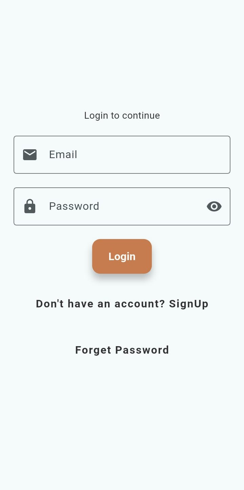
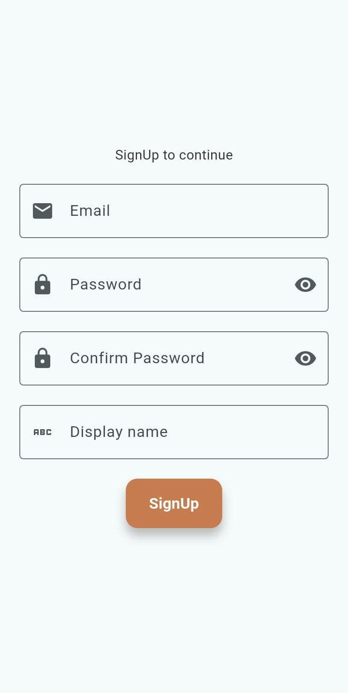
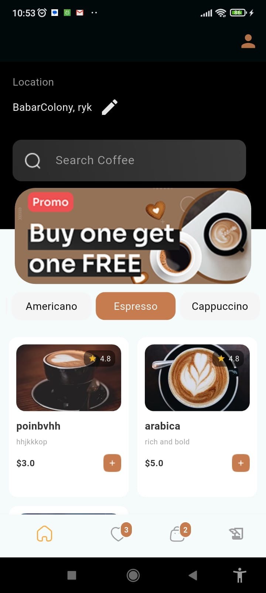
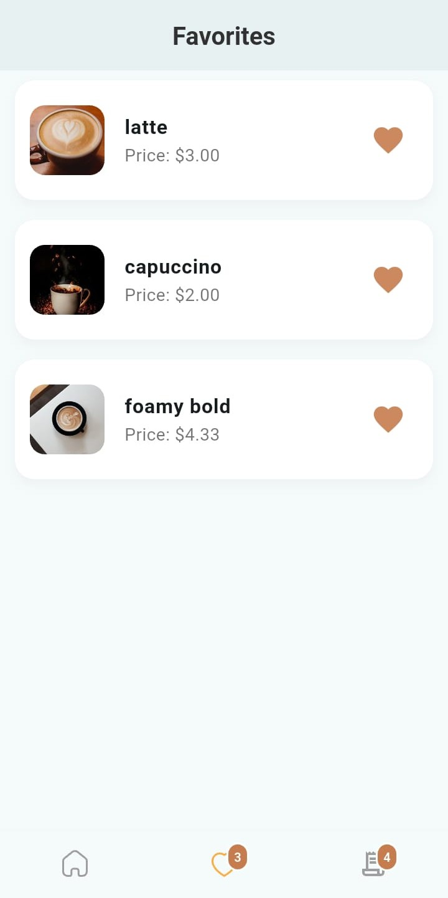
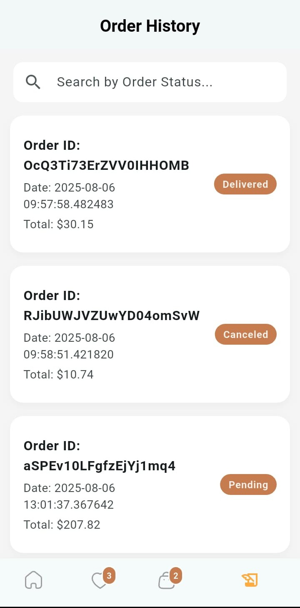
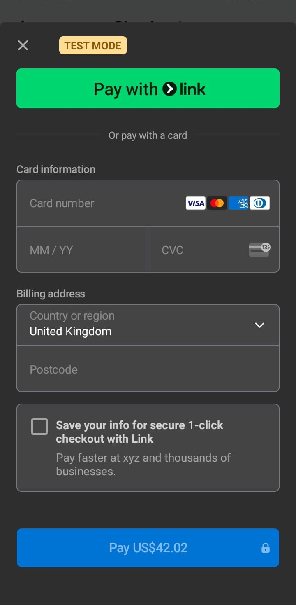
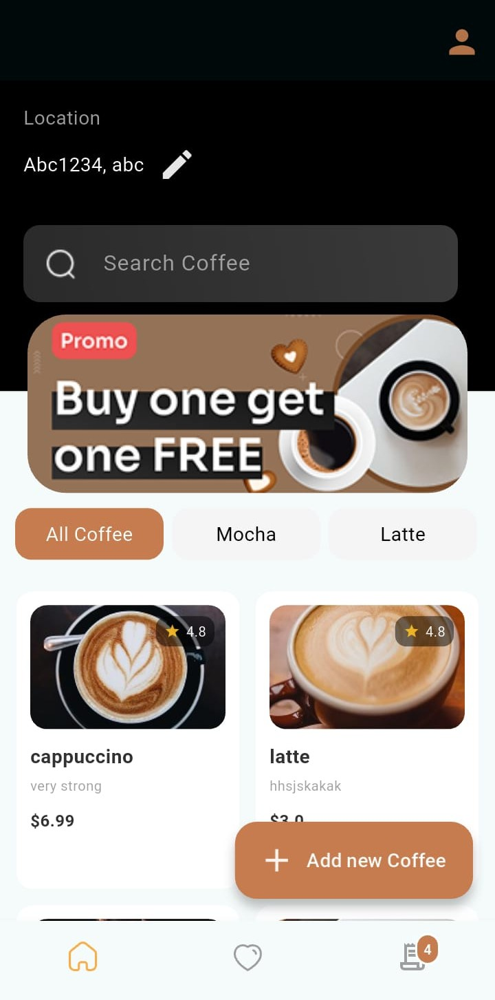

# ☕ Coffee Shop Mobile App

A **full-featured Coffee Shop mobile app** built with **Flutter** following the **MVVM architecture**, integrated with **Firebase** for authentication & real-time database management, and **Stripe Sandbox** for secure payments. Designed to simulate a real-world e-commerce experience for coffee lovers, with separate **user and admin functionality**.

[](https://flutter.dev/)
[](https://firebase.google.com/)
[](https://stripe.com/)
[](https://pub.dev/packages/get)

---

## 🎯 Project Highlights

- **Real-world e-commerce simulation** for coffee shops
- **Admin/User roles** with dynamic access control
- **Real-time updates** using Firebase
- **Secure payments** using Stripe Sandbox
- **MVVM & GetX** for clean architecture and state management

---

## 🛠 Features

### User:
- Browse coffee categories and flavors
- Select size and customize orders
- Add coffees to **Favorites**
- Place orders and track **Order History**
- Update delivery address
- Search for coffees instantly

### Admin:
- Switch roles between **Admin** and **User** (Admin only)
- View all orders with statuses: **Paid, Unpaid, Delivered, Pending, Processing**
- Search orders by **Order ID**
- Detailed order view and **checkout management**

### Shared:
- Dynamic **Bottom Navigation Bar** for smooth screen transitions
- Consistent and responsive **UI/UX** for both user and admin
- Firebase-powered backend for **real-time data sync**

---

## 📸 Screenshots / Demo

### 👤 User Screens
<table>
  <tr>
    <td><br>Login</td>
    <td><br>Sign Up</td>
    <td><br>Categories</td>
    <td><br>Favorites</td>
  </tr>
  <tr>
    <td><br>Order History</td>
    <td><br>Payment Flow</td>
  </tr>
</table>

---

### 🛠 Admin Screens
<table>
  <tr>
    <td><br>Admin Dashboard</td>
    <td><br>Order Management</td>
  </tr>
</table>


## 🛠 Tech Stack

- **Frontend:** Flutter & Dart
- **Architecture:** MVVM (Model-View-ViewModel)
- **State Management & Navigation:** GetX
- **Backend:** Firebase Authentication, Firestore, Realtime Database
- **Payment Integration:** Stripe Sandbox

---

## 🚀 Installation / Setup

1. Clone the repository:
```bash
git clone https://github.com/ayesh-ayesha/coffee-shop-mobile-app.git
cd coffee-shop-mobile-app
```

## 📫 Contact / Connect

- Email: ayeshasiddiqa1087@gmail.com
- LinkedIn: www.linkedin.com/in/ayesha-siddiqa-85690224b
- GitHub: https://github.com/ayesh-ayesha
- Demo Video: https://drive.google.com/drive/folders/10fgonJ2nIU7Ra63D-QcOa8ASP62ZdUWw

